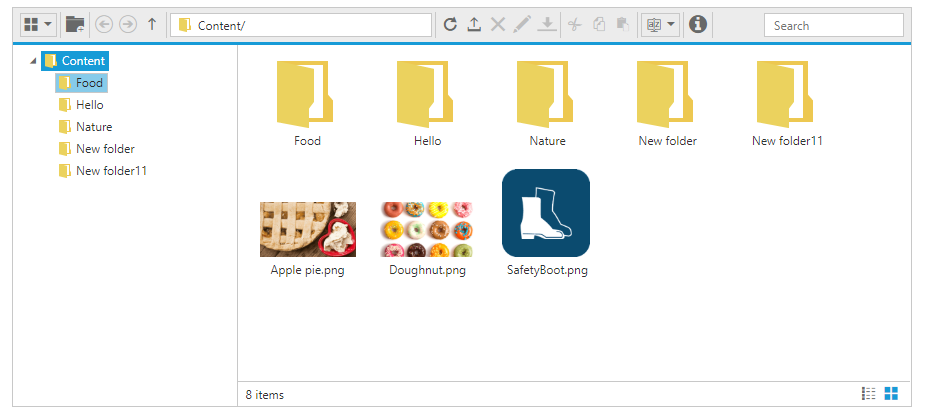

# Azure storage files accessed using EJ1 FileExplorer in Asp Core platform

This example demonstrates how to access azure storage files in the File Explorer in Asp.Net Core platform. In order to achieve this you need to override the FileExplorer basic methods by creating a custom class using the BasicFileOperations abstract class.

## How to run this application?

To run this application, you need to first clone the `EJ1-ASP.NET-Core-File-explorer-to-access-azure-storage` repository and then navigate to its appropriate path where it has been located in your system.

To do so, open the command prompt and run the below commands one after the other.

```
git clone https://github.com/SyncfusionExamples/EJ1-ASP.NET-Core-File-explorer-to-access-azure-storage FE_Azure
cd FE_Azure
```

## Running application

Once cloned, open solution file in visual studio.Then build the project after restoring the nuget packages and run it.

## Final Output

